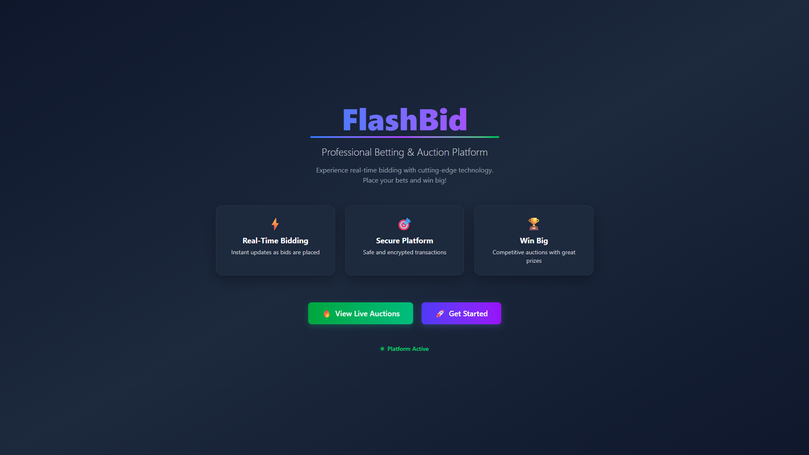
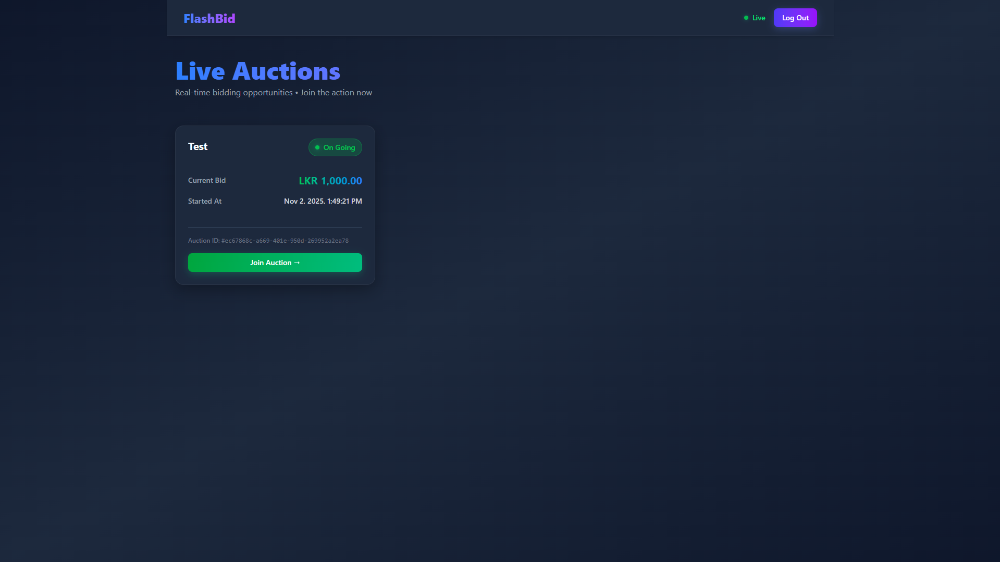
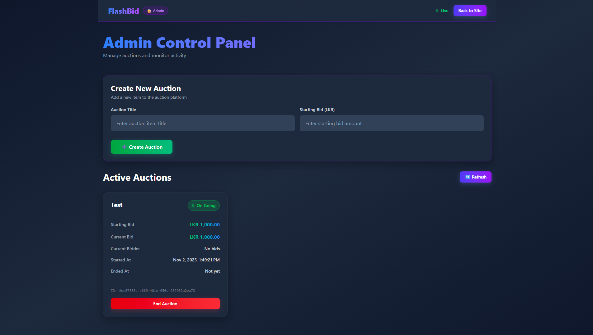

<div align="center">

# ⚡ FlashBid

### 🎯 Professional Real-Time Auction Platform

**Experience lightning-fast bidding with cutting-edge technology. Place your bids and win big!**

[](https://www.oracle.com/java/)
[](https://jakarta.ee/)
[](https://maven.apache.org/)
[](https://tailwindcss.com/)

</div>

---

## 📖 Overview

**FlashBid** is a modern, enterprise-grade real-time auction platform built with Java Enterprise Edition. It enables users to participate in live auctions with instant bid updates, seamless user experience, and comprehensive admin controls. The platform features a beautiful, responsive UI powered by Tailwind CSS and real-time communication through WebSocket technology.

### ✨ Key Highlights

- 🚀 **Real-Time Bidding** - Instant updates as bids are placed via WebSocket
- 🎨 **Modern UI** - Stunning gradient design with Tailwind CSS
- 🔐 **Secure Platform** - Enterprise-grade authentication and authorization
- 👥 **User Management** - Complete user registration and login system
- 🛡️ **Admin Panel** - Full auction management and monitoring capabilities
- ⚡ **High Performance** - Built on Jakarta EE with optimized architecture
- 📱 **Responsive Design** - Works seamlessly on desktop and mobile devices

---

## 🎯 Features

### For Users
- ✅ **User Registration & Authentication** - Secure account creation and login
- ✅ **Live Auction Browsing** - View all active auctions in real-time
- ✅ **Real-Time Bidding** - Place bids with instant feedback and updates
- ✅ **Live Status Indicators** - See auction status (Live/Ended) at a glance
- ✅ **Bid History Tracking** - Monitor current bidder and bid amounts
- ✅ **Beautiful UI** - Gradient cards, smooth animations, and modern design

### For Administrators
- ✅ **Admin Authentication** - Secure admin login system
- ✅ **Auction Creation** - Create new auction items with starting bids
- ✅ **Auction Management** - View all auctions with detailed information
- ✅ **Auction Control** - End auctions manually when needed
- ✅ **Real-Time Monitoring** - Monitor all active auctions with live updates
- ✅ **User Activity Tracking** - View current bidders and bid history

---

## 🛠️ Technology Stack

### Backend
- **Java 17** - Modern Java features and performance
- **Jakarta EE 10** - Enterprise Java platform
- **Maven** - Build automation and dependency management
- **Enterprise JavaBeans (EJB)** - Business logic layer
- **WebSocket API** - Real-time bidirectional communication
- **ActiveMQ** - Message queue for asynchronous processing
- **Log4j 2** - Advanced logging framework
- **Gson** - JSON serialization/deserialization

### Frontend
- **JSP (JavaServer Pages)** - Dynamic web pages
- **Tailwind CSS 4.0** - Utility-first CSS framework
- **JavaScript (ES6+)** - Client-side interactivity
- **Axios** - HTTP client for API calls
- **WebSocket API** - Real-time client communication

### Architecture
- **Multi-Module Maven Project** - Modular architecture
- **EAR Deployment** - Enterprise Application Archive
- **Stateless EJBs** - Scalable business components
- **RESTful Servlets** - API endpoints
- **Filter-Based Security** - Request filtering and authorization

---

## 📁 Project Structure

```
FlashBid/
│
├── FlashBid-core/          # Core models and DTOs
│   └── src/main/java/com/disuraaberathna/flashbid/core/
│       ├── model/           # Domain models (User, AuctionItem)
│       └── dto/              # Data Transfer Objects
│
├── FlashBid-ejb/            # Enterprise JavaBeans (Business Logic)
│   └── src/main/java/com/disuraaberathna/flashbid/ejb/
│       ├── bean/             # EJB implementations
│       │   ├── AuctionManagerBean.java
│       │   ├── BidManagerBean.java
│       │   ├── UserSessionManagerBean.java
│       │   └── MessageSendManagerBean.java
│       ├── remote/           # Remote interfaces
│       ├── store/             # Data storage layer
│       └── validation/       # Validation logic
│
├── FlashBid-web/            # Web Layer (Servlets, JSP, WebSocket)
│   └── src/main/
│       ├── java/com/disuraaberathna/flashbid/web/
│       │   ├── servlet/      # REST API servlets
│       │   ├── filter/       # Security filters
│       │   ├── websocket/    # WebSocket endpoints
│       │   └── mdb/          # Message-driven beans
│       └── webapp/            # Web resources
│           ├── *.jsp         # JSP pages
│           └── css/           # Stylesheets (legacy)
│
└── FlashBid-ear/          # Enterprise Application Archive
    └── src/main/application/
```

---

## 🚀 Getting Started

### Prerequisites

Before you begin, ensure you have the following installed:

- ☕ **Java 17** or higher ([Download](https://adoptium.net/))
- 🔧 **Maven 3.6+** ([Download](https://maven.apache.org/download.cgi))
- 🐘 **Jakarta EE 10 Compatible Application Server** (e.g., GlassFish 7, Payara 6, WildFly 27+)
- 🌐 **Modern Web Browser** (Chrome, Firefox, Edge, Safari)

### Installation

1. **Clone the repository**
   ```bash
   git clone https://github.com/yourusername/FlashBid.git
   cd FlashBid
   ```

2. **Build the project**
   ```bash
   mvn clean install
   ```
   This will compile all modules and create the EAR file.

3. **Deploy to Application Server**
   - Navigate to `FlashBid-ear/target/`
   - Deploy `flash-bid-ear.ear` to your Jakarta EE application server
   - Or use your IDE's deployment feature

4. **Access the Application**
   - Open your browser and navigate to: `http://localhost:8080/flash-bid/`
   - Default context path: `/flash-bid`

### Default Configuration

- **Application Context**: `/flash-bid`
- **WebSocket Endpoint**: `ws://localhost:8080/flash-bid/ws/auction`
- **Server Port**: `8080` (configured in your application server)

---

## 📡 API Endpoints

### User Endpoints
| Method | Endpoint | Description |
|--------|----------|-------------|
| `POST` | `/register` | Register a new user account |
| `POST` | `/login` | User authentication |
| `POST` | `/get-auction-items` | Get all auction items |
| `POST` | `/get-auction-item` | Get specific auction item by ID |
| `POST` | `/place-bid` | Place a bid on an auction |

### Admin Endpoints
| Method | Endpoint | Description |
|--------|----------|-------------|
| `POST` | `/admin-login` | Admin authentication |
| `POST` | `/add-auction-item` | Create new auction |
| `POST` | `/end-auction` | End an active auction |
| `POST` | `/get-users` | Get all registered users |

### WebSocket
| Endpoint | Description |
|----------|-------------|
| `/ws/auction` | Real-time auction updates |

---

## 🎨 Screenshots

> _Screenshots placeholder - Add your application screenshots here_

### Home Page


### Auction Page


### Admin Panel


---

## 🏗️ Architecture

FlashBid follows a **multi-tier enterprise architecture**:

```
┌─────────────────────────────────────────────────┐
│              Presentation Layer                 │
│  (JSP, Tailwind CSS, JavaScript, WebSocket)   │
└─────────────────────────────────────────────────┘
                      ↕
┌─────────────────────────────────────────────────┐
│              Web Layer (Servlets)              │
│  (REST API, Filters, WebSocket Endpoints)      │
└─────────────────────────────────────────────────┘
                      ↕
┌─────────────────────────────────────────────────┐
│         Business Logic Layer (EJB)              │
│  (AuctionManager, BidManager, UserManager)      │
└─────────────────────────────────────────────────┘
                      ↕
┌─────────────────────────────────────────────────┐
│            Data Layer (Store)                   │
│  (In-Memory Data Storage, Validation)          │
└─────────────────────────────────────────────────┘
```

### Key Components

- **EJB Layer**: Stateless session beans handle all business logic
- **Web Layer**: Servlets provide RESTful API endpoints
- **Real-Time**: WebSocket ensures instant bid updates across clients
- **Messaging**: ActiveMQ handles asynchronous message processing
- **Security**: Filters protect admin and user resources

---

## 🔒 Security Features

- ✅ **User Authentication** - Secure login with session management
- ✅ **Admin Authorization** - Separate admin authentication system
- ✅ **Filter-Based Security** - Request filtering for protected resources
- ✅ **Session Management** - Secure session handling
- ✅ **Input Validation** - Server-side validation for all inputs
- ✅ **XSS Protection** - Secure data rendering

---

## 🧪 Testing

### Manual Testing
1. Register a new user account
2. Login with credentials
3. Browse active auctions
4. Place bids on active auctions
5. Monitor real-time bid updates
6. Test admin functionality (admin login required)

### Test Accounts
- Create test users via registration endpoint
- Admin credentials configured in application

---

## 🤝 Contributing

Contributions are welcome! Please follow these steps:

1. **Fork the repository**
2. **Create a feature branch** (`git checkout -b feature/AmazingFeature`)
3. **Commit your changes** (`git commit -m 'Add some AmazingFeature'`)
4. **Push to the branch** (`git push origin feature/AmazingFeature`)
5. **Open a Pull Request**

### Contribution Guidelines
- Follow Java coding conventions
- Write clear commit messages
- Add comments for complex logic
- Update documentation as needed

---

## 📝 License

This project is licensed under the **MIT License** - see the [LICENSE](LICENSE) file for details.

---

## 👨‍💻 Author

**Disura Aberathna**

- GitHub: [@yourusername](https://github.com/yourusername)
- Email: your.email@example.com

---

## 🙏 Acknowledgments

- **Jakarta EE** community for excellent enterprise Java standards
- **Tailwind CSS** team for the amazing utility-first framework
- **Maven** for powerful build automation
- All open-source contributors whose libraries made this project possible

---

## 📈 Future Enhancements

- [ ] Database integration (PostgreSQL/MySQL)
- [ ] Email notifications for bid updates
- [ ] Payment gateway integration
- [ ] Advanced analytics dashboard
- [ ] Mobile application (React Native/Flutter)
- [ ] Redis caching for performance
- [ ] Docker containerization
- [ ] CI/CD pipeline setup
- [ ] Comprehensive test suite
- [ ] API documentation (OpenAPI/Swagger)

---

## 📞 Support

If you encounter any issues or have questions:

1. Check the [Issues](https://github.com/yourusername/FlashBid/issues) page
2. Create a new issue with detailed description
3. Contact the maintainer via email

---

<div align="center">

**Made with ❤️ using Java Enterprise Edition**

⭐ Star this repo if you find it helpful!

[⬆ Back to Top](#-flashbid)

</div>
